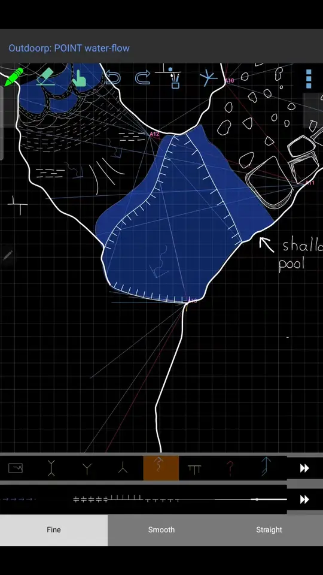
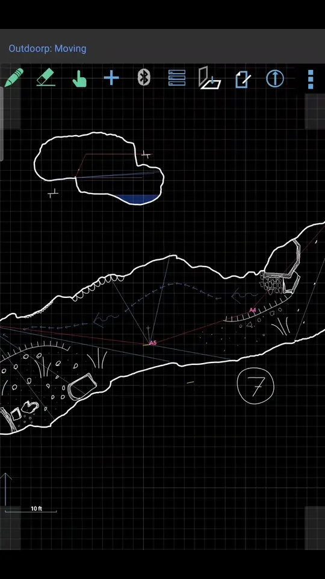
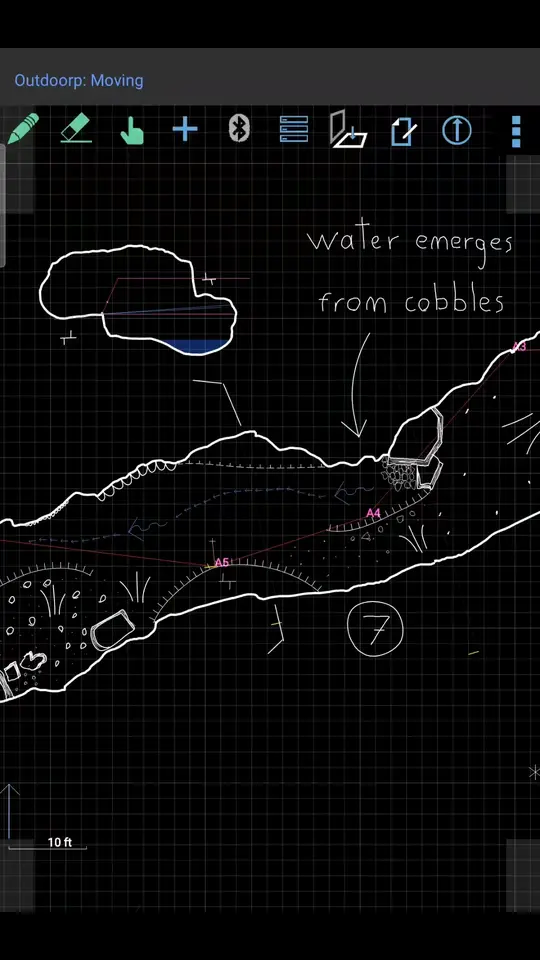
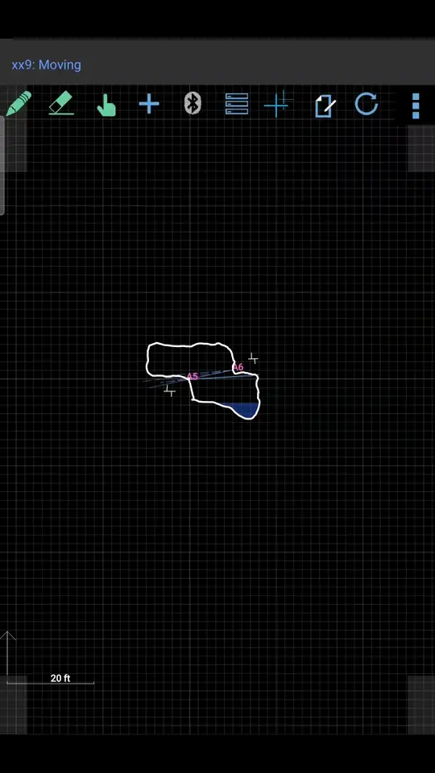
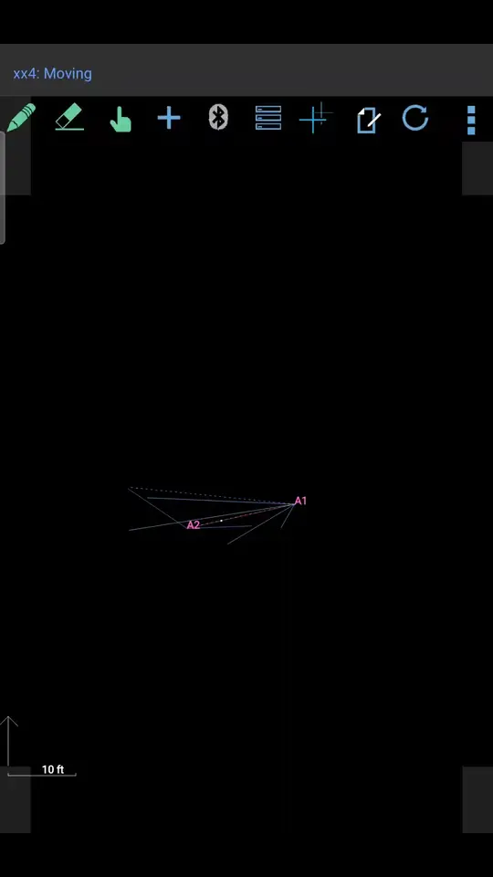
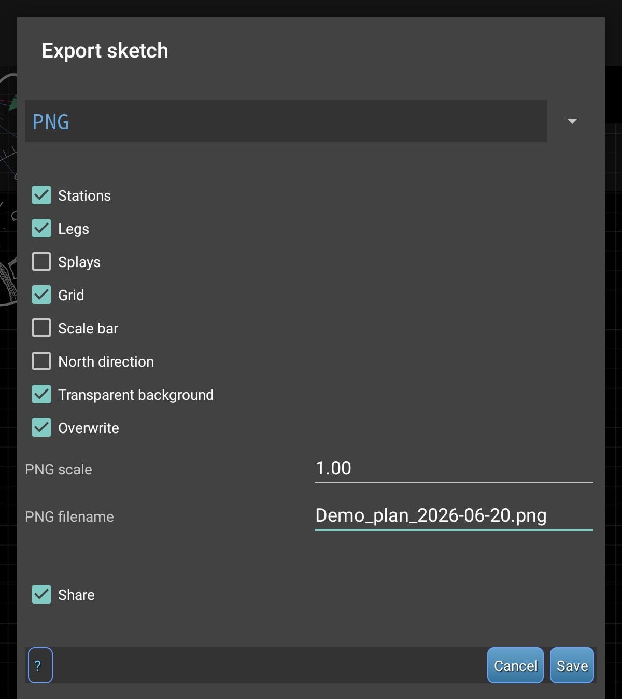
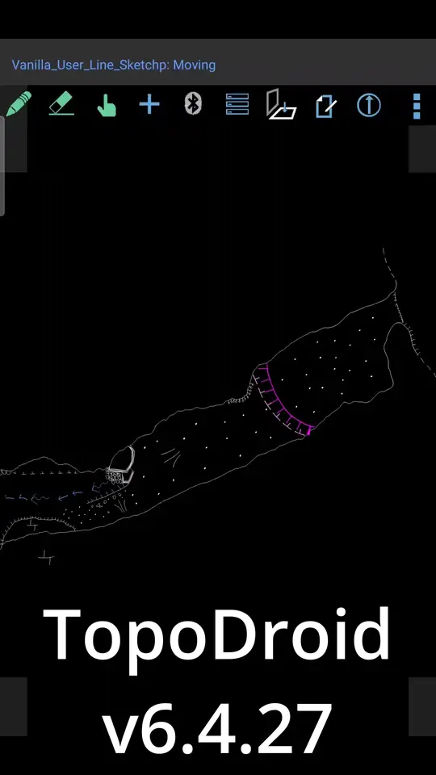
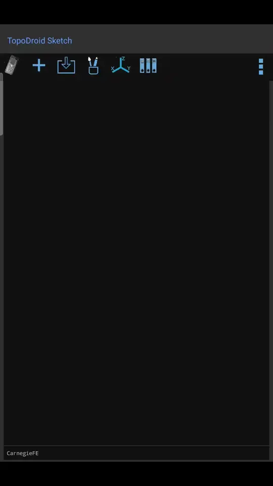

# TopoDroid Sketch

[](https://github.com/MuddyMohawk/topodroid-sketch/releases)
[](COPYING)


<!-- MEDIA: docs/media/hero.png -->

TopoDroid Sketch is a fork of [TopoDroid](https://github.com/marcocorvi/topodroid) for surveyors who sketch by hand and hand the result to a cartographer, instead of feeding symbols into the Therion pipeline. The core data collection and shot taking are unchanged. This fork is about better supporting freehand, paper-style sketching with line weights, stroke style presets, a proper toolbar, and PNG export.

It was built with heavy use of AI coding tools. See the full [changelog](CHANGELOG.md) for everything that's different.

> ⚠️ **Alpha software.** This is an early test release. It has been tested on exactly one device. Updates may cause things to break or change unexpectedly. **Back up your surveys** before and during use, and report anything weird via [Issues](https://github.com/MuddyMohawk/topodroid-sketch/issues) or on Discord.

## Download & install

Grab the latest APK from [Releases](https://github.com/MuddyMohawk/topodroid-sketch/releases) and sideload it. If you already know TopoDroid, the only things you need to know:

- Installs **side-by-side** with vanilla TopoDroid.
  - See [Vanilla TopoDroid compatibility](#vanilla-topodroid-compatibility) for details
- Files live in **`Documents/TopoDroid Sketch/`**, not `Documents/TDX/`.
- Written in English; other translations are likely broken.

## Features

### Line Weights

Three freehand pen weights (thin / standard / thick) with per-weight width and color settings. 



### Drawing/Stroke Style Presets

Three drawing style presets have been added and can be quickly toggled via a new toolbar in the sketching screen. The `fine` preset using the `fine` line style with a line-point spacing of 1. `Smooth` uses the bezier curve style, and `Straight` uses a newly added `straight` line style for drawing perfectly straight lines. You can edit, add, remove, or adjust the presets from the settings screen. 



### Toolbar Overhaul

The recents bar is replaced with manually assigned tool slots, saved per survey. You can add up to 8 rows, edit the number of buttons per row, and lock a row to lines, points, or areas.



### S Pen, Active Key, and hardware buttons

Bind undo, redo, back, erase/draw toggle, preset toggle, and palette toggle to the S Pen button, the Active Key, or the volume keys. Defaults: S pen single-click undoes, double-click goes back, and long-click swaps line style presets.

<!-- MEDIA: docs/media/spen.webp — 10-15s: drawing, clicking the pen to undo, long-clicking to swap preset, drawing again -->

### Cross-section viewports

Place cross-sections directly on the plan sketch as movable viewports instead of separate plots. Currently only supported for the section line, not at-station cross-sections. Draw the section line, tap "place on plan". Like vanilla TopoDroid, use the edit button to select and open the cross-section for drawing.



### Reference images

Drop a photo onto the sketch. You can scale, rotate, set opacity, sketch over it, and hide it when done.



### PNG export

Export the sketch as a PNG sized for handing to a cartographer. The stations, legs, splays, grid, north arrow, scale bar, and background transparency all toggleable. The output can be scaled from 0.05x to 4.0x. I recommend 1x-2x for cartographer export, 0.5x or less for previewing on the device.



### Line Symbol Rendering

Line symbols, such as the pit/ledge line, stamp rigidly along curves at a fixed size instead of warping and scaling. Use the `Line style scale` setting to adjust their sizing in the sketch settings.



### In-app symbol editor

Edit most symbols from the palette window. It's basic, but allows for quick adjusting of colors and such. This will likely be further improved with the planned symbol overhaul.



### Small stuff

Most symbols are now white by default. Added a proper color picker, grid width/color/unit options (including 1 ft grid scale), overlapping areas darken instead of lighten, bigger default icons, and other assorted tweaks. See the [changelog](CHANGELOG.md) for the full details.

## Vanilla TopoDroid compatibility

Right now, you should be able to import a .zip export from the original TopoDroid. Going back is untested. In the future a dedicated importer/exporter will be made for ensuring a base level of cross-compatibility.

## Known issues

Known bugs are currently listed in [the roadmap](docs/roadmap.md).

## What's next

The next major planned feature is overhauling the brush/symbol picker experience. After that is adding in robust auto-backup features. All the brainstorming ideas are in [the roadmap](docs/roadmap.md).

## Building from source

JDK 21 + Android SDK. Clone, copy your `local.properties` or let Android Studio generate it, then:

```
gradlew.bat assembleDebug
```

Release builds are signed via an untracked `keystore.properties` — see `keystore.properties.template`. Versioning scheme is documented in [docs/versioning.md](docs/versioning.md), the test suite in [docs/testing.md](docs/testing.md).

## Credits & license

This was built on the original, generously GPL'd [marcocorvi/topodroid](https://github.com/marcocorvi/topodroid).

TopoDroid Sketch was essentially entirely vibe-coded with AI assistants (Codex and Claude). From my estimation, learning Android development and making this fork by hand would have taken 6-8 years at my available weekly time investment.

GNU General Public License v3 — see [COPYING](COPYING).
